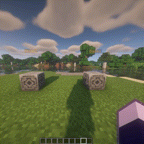
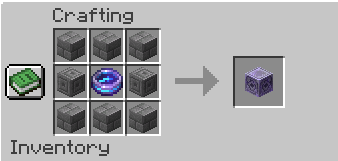
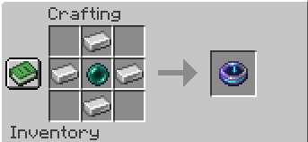

# ✨A waystone mod like but for spigot✨
Welcome to waystone, the Minecraft plugin that transforms your teleportation experience Say goodbye to outdated /home and /tpa commands. With waystone, use a magical amulets and a teleportation system inspired by the Waystone mod, all integrated into a simple and intuitive graphical interface with beautifull animations.

## ✅ Features

- ⚙️ __Highly configurable :__ Customize AmuletGate to fit your server's unique needs. With an extensive configuration file, you can enable or adjust settings and more. For the moment the plugin is translated only in English and French
- 🛸 __Players teleportation :__ Easily teleport to your friends with a simple click. AmuletGate’s intuitive interface allows you to send and accept teleportation requests, making it easier than ever to meet up and explore together.
- 👋 __User friendly :__ Designed with ease of use in mind, AmuletGate features a clean and intuitive graphical interface. Say goodbye to complicated commands and enjoy a smooth, user-friendly teleportation system that everyone can use.
- 🏠 __Custom Home Points :__ Set and manage multiple home points effortlessly. Whether it’s your base, favorite mining spot, or secret hideout, AmuletGate lets you return to your important locations with ease.
- ✨ __Beautiful animations :__ Experience teleportation like never before with stunning animations. AmuletGate enhances the visual appeal of teleporting, making each journey an enchanting experience.

## 🎬 Demo

| Waystone teleportation | Waystone Rename | Amulet teleportation
| :--:  | :--: | :--: |
||| 

__Note :__ This plugin also allows teleportation between players but is not shown in the examples
## 🛠️ Crafts
| Waystone      |  Amulet |
| :--:  | :--: |
|||

## ⬇️ Download
The plugin is downloadable [here](https://github.com/thibault0712/waystone/releases/tag/Release)

